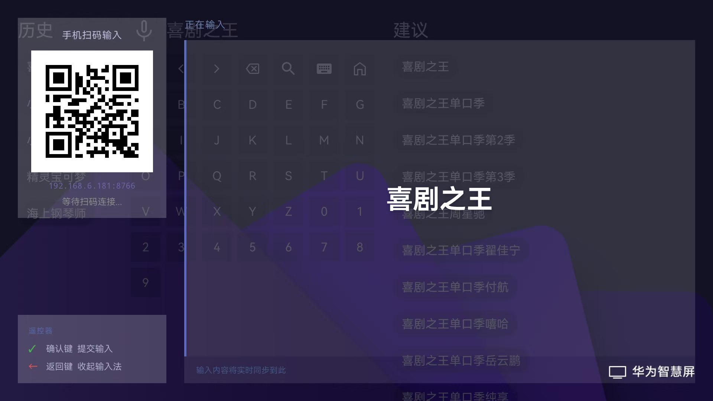
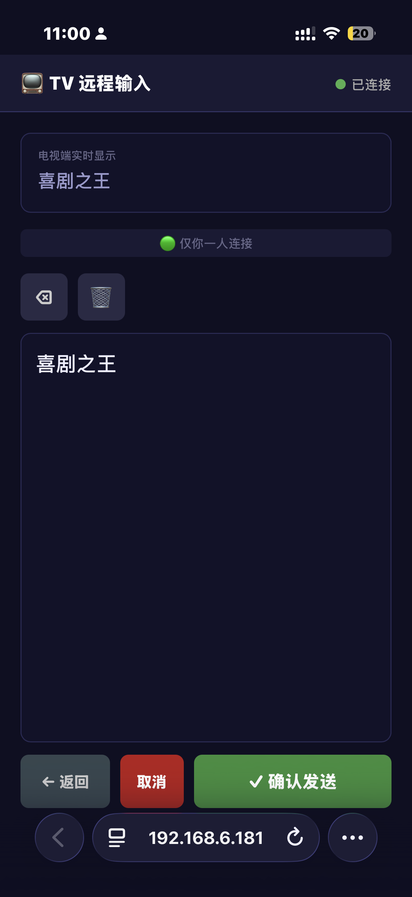

# TVKeyboard（中文说明）
[[English](../README.md)] | [**简体中文**]

用手机作为安卓电视的远程键盘——在手机上打字，内容实时显示在大屏上。

| tv                  | phone                     |
|---------------------|---------------------------|
|  |  |


---

## 工作原理

TVKeyboard 在电视上以系统输入法（IME）的形式运行。任意 App 的输入框获得焦点时，IME 面板弹出并显示二维码。用手机浏览器扫码即可打开输入页面，**手机无需安装任何 App**。在浏览器中输入的内容通过局域网 WebSocket 实时同步到电视。

---

## 功能

- 作为**系统级输入法**运行，支持电视上所有 App 的输入框
- 手机端使用**浏览器**，无需安装 App
- 通过局域网 WebSocket **实时同步**
- 支持多台手机同时连接（最后输入的内容生效）
- 手机端支持：退格、清空、确认、收起、方向键、返回键
- IME 面板半透明，可看到背景内容

---

## 环境要求

- 安卓电视（已在华为电视上测试）
- Android SDK 21+
- 手机和电视在**同一 Wi-Fi 网络**下

---

## 构建

```bash
# macOS / Linux
./gradlew assembleDebug

# Windows
.\gradlew.bat assembleDebug
```

APK 输出路径：`app/build/outputs/apk/debug/app-debug.apk`

**通过 ADB 安装到电视（推荐）：**
```bash
adb connect <电视IP>
adb install -r app-debug.apk
```

---

## 使用步骤

1. 在电视上安装 APK
2. 进入**设置 → 语言与输入法 → 当前键盘**，启用 **TV Remote Keyboard**
3. 将其设为默认输入法
4. 打开任意 App，导航到输入框，IME 面板自动弹出
5. 用手机扫描二维码
6. 开始输入

**遥控器操作：**
- `确认键 / OK` — 提交输入
- `返回键` — 收起输入法

---

## 端口说明

| 服务 | 端口 |
|------|------|
| WebSocket | 8765 |
| HTTP（网页） | 8766 |

如端口被占用，修改 `TvWebSocketServer.java` 中的 `DEFAULT_PORT` 和 `TvHttpServer.java` 中的 `HTTP_PORT`。
